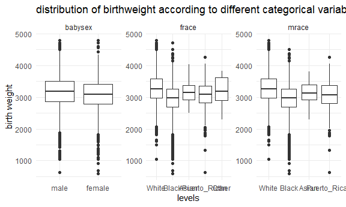
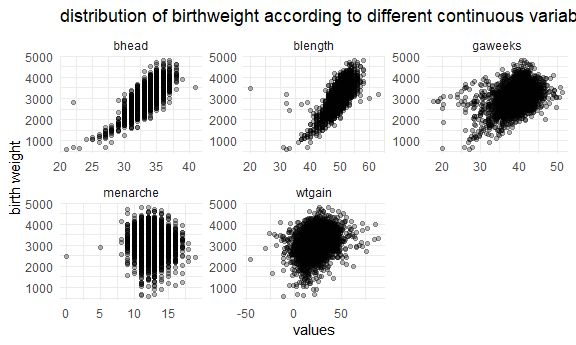
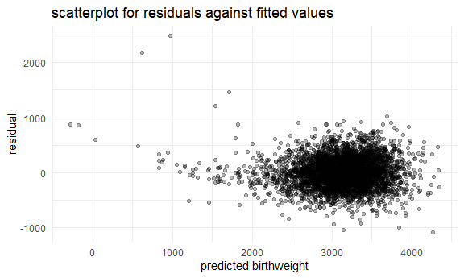
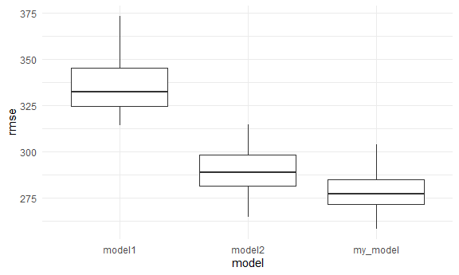

p8105_hw6_xl3141
================
Xinyuan Liu
11/28/2021

## Set up

``` r
library(tidyverse)
```

    ## -- Attaching packages --------------------------------------- tidyverse 1.3.1 --

    ## v ggplot2 3.3.5     v purrr   0.3.4
    ## v tibble  3.1.6     v dplyr   1.0.7
    ## v tidyr   1.1.4     v stringr 1.4.0
    ## v readr   2.1.0     v forcats 0.5.1

    ## -- Conflicts ------------------------------------------ tidyverse_conflicts() --
    ## x dplyr::filter() masks stats::filter()
    ## x dplyr::lag()    masks stats::lag()

``` r
library(modelr)
library(mgcv)
```

    ## Loading required package: nlme

    ## 
    ## Attaching package: 'nlme'

    ## The following object is masked from 'package:dplyr':
    ## 
    ##     collapse

    ## This is mgcv 1.8-38. For overview type 'help("mgcv-package")'.

``` r
knitr::opts_chunk$set(
  fig.width = 6,
  fig.asp = .6,
  out.width = "90%"
)

theme_set(theme_minimal() + theme(legend.position = "bottom"))

options(
  ggplot2.continuous.colour = "viridis",
  ggplot2.continuous.fill = "viridis"
)

scale_colour_discrete = scale_colour_viridis_d
scale_fill_discrete = scale_fill_viridis_d
```

## Problem 1

``` r
birthweight_df = read_csv("birthweight.csv")
```

    ## Rows: 4342 Columns: 20

    ## -- Column specification --------------------------------------------------------
    ## Delimiter: ","
    ## dbl (20): babysex, bhead, blength, bwt, delwt, fincome, frace, gaweeks, malf...

    ## 
    ## i Use `spec()` to retrieve the full column specification for this data.
    ## i Specify the column types or set `show_col_types = FALSE` to quiet this message.

``` r
birthweight_df= 
  birthweight_df %>% 
    drop_na() %>% 
    mutate(
      babysex = fct_recode(factor(babysex), male = "1", female = "2"),
      frace = fct_recode(factor(frace), White = "1", Black = "2", Asian = "3", Puerto_Rican = "4", Other = "8"),
      malform = fct_recode(factor(malform), absent = "0", present = "1"),
      mrace = fct_recode(factor(mrace), White = "1", Black = "2", Asian = "3", Puerto_Rican = "4")
    )
```

From my point of view, the child’s birthweight should be associated with
baby’s sex, baby’s head circumference at birth, baby’s length at birth,
gestational age, mother’s age at menarche, mother’s race, father’s race,
and mother’s weight gain during pregnancy.

First, let’s explore if the categorical variables I listed above have
some influence on the child’s birth weight!

``` r
birthweight_df %>% 
  select(bwt, babysex, frace, mrace) %>% 
  pivot_longer(
    cols = -bwt,
    names_to = "category",
    values_to = "levels"
  ) %>% 
  ggplot(aes(y = bwt, x = levels)) +
  geom_boxplot() +
  facet_wrap(. ~ category, scale = "free") +
  labs(
    y = "birth weight",
    title = "distribution of birthweight according to different categorical variables"
  )
```



It seems that all of them will affect child’s birthweight. Then, let’s
take a look at continuous variables

``` r
birthweight_df %>% 
  select(bwt, bhead, blength, gaweeks, menarche, wtgain) %>% 
  pivot_longer(
    cols = -bwt, 
    names_to = "variables",
    values_to = "values"
  ) %>% 
  ggplot(aes(x = values, y = bwt)) +
  geom_point(alpha = .3) +
  facet_wrap(. ~ variables, scales = "free")+
  labs(
    y = "birth weight",
    title = "distribution of birthweight according to different continuous variables"
  )
```



It seems that mother’s age at menarche does not have a significant
impact on child’s birthweight from the scatterplot, so I will remove
that variable in my model.

Here is my model:

``` r
my_model = lm(bwt ~ bhead + blength + gaweeks + wtgain + babysex + frace + mrace, data = birthweight_df)
```

Let’s look at the residuals in our model

``` r
birthweight_df %>% 
  modelr::add_residuals(my_model) %>% 
  modelr::add_predictions(my_model) %>% 
  ggplot(aes(x = pred, y = resid)) +
  geom_point(alpha = .3) +
  labs(
    title = "scatterplot for residuals against fitted values",
    x = "predicted birthweight",
    y = "residual"
  )
```



compare with the other 2 model provided

``` r
model1 = lm(bwt ~ blength + gaweeks, data = birthweight_df)
model2 = lm(bwt ~ bhead + babysex + blength + bhead * babysex + bhead * blength + babysex * blength + babysex * blength * bhead, data = birthweight_df)
```

Test the model fit

``` r
set.seed(2)
cv_df = 
  crossv_mc(birthweight_df, 100) %>% 
  mutate(
    train = map(train, as_tibble),
    test = map(test, as_tibble)
  )

cv_df = 
  cv_df %>% 
  mutate(
    my_model = map(.x = train, ~ lm(bwt ~ bhead + blength + gaweeks + wtgain + babysex + frace + mrace, data = .x)),
    model1 = map(.x = train, ~lm(bwt ~ blength + gaweeks, data = .x)),
    model2 = map(.x = train, ~lm(bwt ~ bhead + babysex + blength + bhead * babysex + bhead * blength + babysex * blength + babysex * blength * bhead, data = .x))
    )%>% 
  mutate(
    rmse_my_model = map2_dbl(.x = my_model, .y = test, ~rmse(model = .x, data = .y)),
    rmse_model1 = map2_dbl(.x = model1, .y = test, ~rmse(model = .x, data = .y)),
    rmse_model2 = map2_dbl(.x = model2, .y = test, ~rmse(model = .x, data = .y))
  )

cv_df %>% 
  select(starts_with("rmse")) %>% 
  pivot_longer(
    everything(),
    names_to = "model",
    values_to = "rmse",
    names_prefix = "rmse_") %>% 
  ggplot(aes(x = model, y = rmse)) +
  geom_boxplot()
```



The plot above compared the prediction error of three models. The model
using baby’s length at birth has the highest average rmse compared to
other two models, indicating a worse fitting of this model. My model
seems to have the smallest rmse among the three models which means it
predicts the child’s birth weight better than other two models provided.
